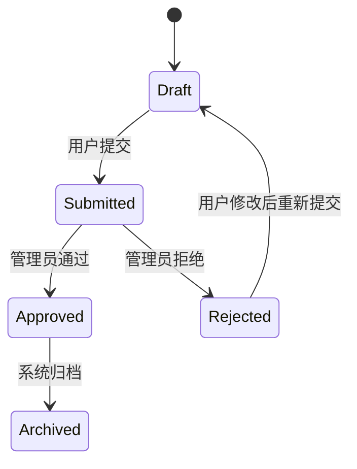

# 业务规则设计

本文件用于指导业务规则设计。当设计任务涉及业务概念、业务规则、状态流转、计算规则、约束时加载。

## 适用场景

- 需要定义业务概念、术语、角色、权限或实体之间的关系。
- 需要说明某个业务动作在什么条件下允许或禁止。
- 需要设计状态机、生命周期或审批流。
- 需要定义价格、额度、折扣、结算、排序、优先级等计算规则。
- 需要处理跨角色、跨租户、跨组织或跨系统的业务约束。
- 需要把口头规则整理成可验证、可实现、可测试的规则集。

## 输入检查

进入业务规则设计前，先确认以下输入是否可用：

- 产品设计中的用户、能力、用户故事和可验证需求。
- 项目已有业务术语、规则文档、ADR 或领域模型。
- 现有代码中已经实现的规则和状态。
- 数据库设计中的核心实体和字段。
- API 设计中的动作和失败场景。

如果业务术语含糊，先澄清术语，不要直接写规则。

## 业务规则设计关注点

### 业务术语

先定义术语，再定义规则。

每个术语应说明：

- 它是什么。
- 它不是什么。
- 它和相邻概念有什么区别。
- 是否有旧名称、别名或容易混淆的说法。

例如：

```markdown
**客户**：购买产品或服务的个人或组织。
_Avoid_：用户、账号。客户和登录系统的用户不是同一个概念。
```

### 角色和权限

说明谁可以做什么，不能只写“有权限的人”。

至少明确：

- 角色有哪些。
- 每个角色可以执行哪些动作。
- 权限是全局、组织级、租户级还是资源级。
- 多角色叠加时如何决策。
- 权限变化何时生效。

### 状态和生命周期

如果对象有状态变化，必须明确状态机。

状态设计要说明：

- 所有合法状态。
- 初始状态。
- 终止状态。
- 合法状态转移。
- 谁或什么事件触发转移。
- 不允许的转移。
- 状态转移后的副作用。

优先使用 Mermaid 表达状态机：



### 条件规则

业务规则通常是条件判断。

用清晰格式表达：

```markdown
### Rule: 只有过期用户可以被批量禁用

- WHEN 管理员批量禁用用户
- AND 选中的用户全部处于“已过期”或“已停用”状态
- THEN 系统允许禁用
- OTHERWISE 系统拒绝操作，并提示无法禁用活跃用户
```

避免写成模糊描述：

```text
系统应该合理判断用户能不能禁用。
```

### 计算规则

计算规则要避免只写公式。

需要说明：

- 输入字段。
- 计算公式。
- 单位和精度。
- 舍入规则。
- 边界值。
- 优先级。
- 示例。

例如：

```markdown
### Rule: 订单折扣金额

- 输入：订单原价、折扣比例、最大折扣金额。
- 公式：`min(订单原价 × 折扣比例, 最大折扣金额)`。
- 舍入：保留 2 位小数，四舍五入。
- 示例：订单原价 199.99，折扣 10%，最大折扣 15，则折扣金额为 15.00。
```

### 优先级和冲突

多个规则可能同时命中，必须说明优先级。

常见冲突：

- 多个优惠同时适用。
- 用户有多个角色。
- 全局规则和局部规则冲突。
- 人工配置和系统默认规则冲突。
- 历史规则和新规则冲突。

设计时要说明冲突解决策略，而不是让实现者猜。

### 时间规则

时间相关规则要明确时区和边界。

至少说明：

- 使用哪个时区。
- 起止时间是否包含边界。
- 日期切换点。
- 延迟生效还是立即生效。
- 历史记录按创建时间、更新时间还是业务时间计算。

### 可验证场景

每条关键规则都应该能用场景验证。

场景应覆盖：

- 正常路径。
- 边界值。
- 禁止路径。
- 冲突路径。
- 历史数据或兼容场景。

## 工作方式

### 先统一语言

如果用户使用“账号”“用户”“客户”“成员”这类可能混淆的词，先确定含义。

不要在一份规则文档里混用多个词指代同一概念。

### 用具体例子逼出边界

业务规则最容易在边界场景出问题。

遇到模糊规则时，构造具体例子：

- “如果用户既是管理员又是普通成员，按哪个角色判断？”
- “如果订单在活动结束前 1 秒创建、活动结束后支付，是否享受优惠？”
- “如果批量操作中有一条失败，是全部失败还是部分成功？”

### 区分规则和实现

业务规则描述业务事实和约束，不写具体代码结构。

可以说明“必须保证唯一”，但不要直接指定“用某个函数实现”。

如果规则必须依赖数据库约束或事务来保证，可以说明约束需求，但具体实现留给数据库或架构设计。

### 标记未决问题

不要把未确认的规则写成确定结论。

未确认的地方放入“开放问题”，并说明为什么影响设计。

## 补充检查点

本 reference 不规定输出结构；输出结构由 `design-change` 命令本体与 `.workflow/templates/changes/design/` 统一决定。

使用业务规则视角时，重点确认：

- 业务术语、角色、权限和状态是否定义清楚。
- 规则是否用可验证的条件和结果表达。
- 计算规则、时间边界和优先级冲突是否明确。
- 未确认规则是否标记为开放问题。
- 是否避免把业务规则写成代码结构或实现步骤。

## 质量检查

完成业务规则设计后，检查：

- 是否先定义术语，再定义规则。
- 是否覆盖角色、权限、状态和生命周期。
- 是否用 WHEN/THEN 或规则格式表达关键规则。
- 是否覆盖正常、边界、禁止和冲突场景。
- 是否定义计算规则的精度、单位和舍入。
- 是否明确时间规则和时区。
- 是否区分业务规则和实现方案。
- 是否标记未确认规则，而不是伪装成结论。
