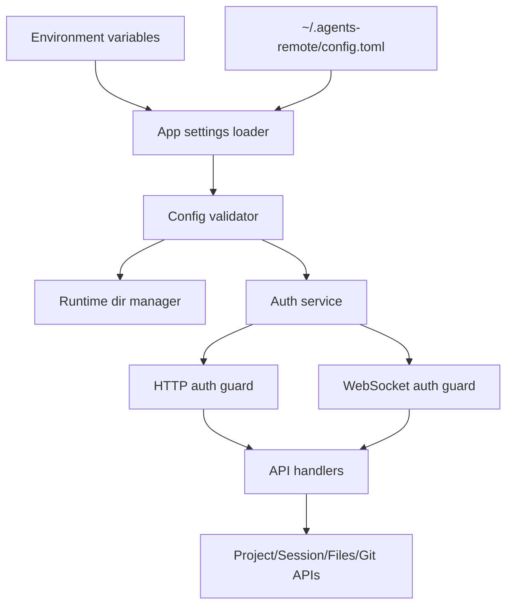

# Architecture Design

## Change

- change-id：configure-personal-app-settings

## 架构上下文

当前仓库已有 Bun monorepo 基础，`api` 入口为 `api/src/index.ts`，目前只包含 `/api/health` 和 `/api/ws/echo`。本 change 要在不破坏 `web/api` 服务边界和 `/api` 同域约定的前提下，为后续 Project、Session Runtime、Files、Git 和 WebSocket stream 提供统一配置与认证基础。

## 系统边界

- `App settings loader` 是配置入口，调用方不直接读取 `process.env` 或 TOML 文件。
- `Config validator` 负责启动时 fail-fast，避免半配置状态进入可用服务。
- `Runtime dir manager` 只处理运行态目录创建和权限错误，不存长期配置。
- `Auth service` 负责密码校验、token 签发和 token 校验。
- `HTTP auth guard` 与 `WebSocket auth guard` 是入口层保护，业务 handler 不重复实现认证。

## 模块关系

建议后续实现时保持以下边界：

- `api` startup composition：组装 settings、auth、server handlers。
- settings/config 模块：读取默认配置文件、环境变量覆盖、校验字段、生成模板。
- runtime-dir 模块：创建/检查运行态目录，暴露已解析路径。
- auth 模块：处理单密码和本地 token，不理解 Project 或 provider。
- request guard：从 HTTP/WebSocket 请求中提取认证状态，调用 auth 模块校验。
- domain handlers：只接收已认证上下文和 settings，不直接访问 secret 或原始 config source。

该边界避免后续 Project、Session Runtime、Files、Git 模块各自读取配置或各自实现 token 校验。

## 技术选型 / 方案取舍

- TOML 配置是用户已确认的第一轮默认格式；本阶段不新增其他配置格式。
- 使用 Bun/TypeScript 现有运行时能力，不为配置/认证设计引入额外服务。
- token 采用本地签发语义即可，不引入 refresh token、设备表或服务端 session 列表。
- runtime dir 默认 `/run/agents-remote`，允许 `AGENTS_REMOTE_RUN_DIR` 覆盖以支持无权限环境。
- 配置文件默认 `~/.agents-remote/config.toml`，环境变量覆盖配置文件，用于 CI、容器和临时调试。

## 演进策略

1. 第一轮只实现单实例个人部署配置和认证。
2. 后续 Project 安全解析统一消费 settings 中的 absolute `projects_root`，不重新解析配置来源。
3. 后续 HTTP API 和 WebSocket stream 统一接入 auth guard。
4. 如果未来引入 hub/server 列表或多用户能力，应新增长期配置/身份模型，而不是扩展当前单密码 token 为多用户权限系统。
5. 如果未来做网页初始化配置或 CLI init，应复用 settings/config 模块生成和校验 TOML 的能力。

## 关键决策

- fail-fast：缺少必要配置、相对 `projects_root`、runtime dir 创建失败都阻止 `api` 启动。
- 单一配置入口：后续模块只消费已校验 settings，不直接读 env/TOML。
- 单一认证入口：所有受保护 HTTP/WebSocket 入口共享 token 校验。
- 登录认证和路径安全分离：通过 token 只代表用户已登录，不代表请求路径安全。
- persistent app dir 与 runtime dir 分离：避免把 socket/lock 或 session metadata 写入用户持久配置目录。

## 风险与权衡

- 只做本地 token 简化个人部署，但服务端重启可能使登录状态失效；这是已接受的第一轮行为。
- 配置文件支持 `APP_PASSWORD` 提升易部署性，但需要权限限制和日志脱敏，避免泄露 secret。
- fail-fast 会让首次启动不可直接使用，但能避免不安全默认密码和错误 projects_root。
- 不设计网页初始化降低范围，但用户需要手动编辑 TOML；这是第一轮可接受取舍。

## 开放问题

- token 存储和传输载体在实现阶段需要选择 cookie 或前端存储；设计约束是 HTTP/WebSocket 自动携带且用户无感。
- 是否需要在启动日志中显示 config path 和 runtime dir path，需在 error-handling 中控制敏感信息边界。
- 配置文件字段命名应在 plan/implement 阶段与 shared DTO 或 docs 保持一致。

## 后续沉淀候选

- `docs/architecture/config-auth-boundary.md`
- `docs/architecture/runtime-directory-boundary.md`
