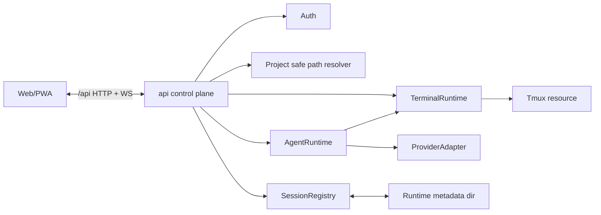

# Architecture Design

## Change

- change-id：design-session-runtime-boundaries

## 架构上下文

- `web` 与 `api` 已分离；对外 HTTP 与 WebSocket 都走同域 `/api` 前缀。
- `api` 当前只有 auth、Project API 和 echo WebSocket；session runtime、tmux、PTY、xterm stream 尚未实现。
- `packages/shared` 已有最小 `AgentSession`、`TerminalSession`、provider 和状态类型，但缺少 session API DTO。
- `runtime-dir` 已提供默认 `/run/agents-remote` 与 `AGENTS_REMOTE_RUN_DIR` 覆盖，是本 change 的运行态 metadata 边界。
- Project 安全解析已在 `api/src/project-paths.ts` 中完成，Terminal/Agent 启动目录必须复用该边界。

## 系统边界

- `web`：只通过 `/api` HTTP/WS 操作 session，不直接知道 tmux、runtime dir 或 provider adapter 内部结构。
- `api control plane`：认证、Project 安全解析、session HTTP API 和 WebSocket upgrade 入口。
- `SessionRegistry`：维护当前运行实例 metadata、状态索引和 internal session id 到 runtime resource 的映射。
- `TerminalRuntime`：负责普通 shell/tmux lifecycle、stream attach、input、resize、buffer snapshot 和 close。
- `AgentRuntime`：负责 Agent Session lifecycle，第一轮可委托 TerminalRuntime 承载 Claude/Codex CLI passthrough，但对上保持 Agent 语义。
- `ProviderAdapter`：后续吸收 Claude/Codex 差异；第一轮只需要 provider launch profile，不把 provider-native thread/turn 固化到 core API。
- `StreamTransport`：WebSocket 连接、断开、重连和 terminal byte/event relay；它不是 session 本身。

## 模块关系

- `api` 先通过 auth 和 Project 安全解析确认请求作用域，再读写 registry。
- registry 是运行态权威索引；runtime dir 中的 metadata 是进程内 registry 重建和跨请求共享的来源。
- Agent 第一轮可使用 TerminalRuntime 启动 `claude` / `codex` CLI，但 Agent API 不暴露 terminal implementation field。

## 技术选型 / 方案取舍

- 选择 `tmux + xterm/WebSocket` 作为第一轮真实交互链路：能保留 provider CLI 自身的 slash commands、plugins、autocomplete 和提示。
- 不选择 provider-native protocol 作为第一轮强依赖：Codex app-server/Claude remote-control/API/SDK 差异仍需后续 provider experience 验证。
- 选择运行态 metadata 而非数据库：当前只要求恢复仍存在的 tmux session，不要求跨服务器重启恢复。
- 选择 internal session id 做控制面主键：避免 provider-native id、Project 名称或 tmux name 漂移影响 URL/API。

## 演进策略

- 第一步实现 Terminal Session runtime 作为端到端链路和 E2E baseline。
- Agent Session 初期复用 terminal passthrough，但 metadata 和 API 保留 provider 字段与 Agent 状态。
- 后续 `implement-agent-provider-experience` 可以在 AgentRuntime 内新增 provider-native adapter，而不改变 TerminalSession API。
- 后续 Files/Git capability 仍走 Project API 与 safe path resolver；只有 Agent 主动工具请求时再进入 Agent capability envelope。

## 关键决策

- `SessionRegistry` 属于 `api`，不是 `packages/shared`；shared 只放 DTO、枚举和错误码。
- `transportSession` 是 WebSocket attach/reconnect 生命周期，不是 Agent/Terminal Session 生命周期。
- `conversationThread` 与 `turn/run` 是后续 provider-native Agent 语义，不由 TerminalSession 承担。
- tmux session name 由安全 project slug/hash、session type、provider 和 short id 组成，仅用于服务器诊断和 attach。
- registry 列表读取时允许同步校验 tmux 存在性并清理失效 metadata。

## 风险与权衡

- 如果 registry 只存运行态 metadata，服务器重启后列表会丢失；这是当前 scope 接受的边界。
- 如果 AgentRuntime 初期过度依赖 terminal bytes，后续原生 UI 会困难；因此只允许在 adapter/runtime 内部复用，不进入 API contract。
- tmux attach、scrollback、resize 和 backpressure 的细节需要实现阶段用真实 shell 验证。

## 开放问题

- 多客户端写入控制权策略未定；本设计只要求 transport 状态可见和可重连。
- Agent `waiting_input` 的信号来源未定；provider-native adapter 后可增强。
- 是否需要 runtime metadata 文件锁，取决于实现时是否存在多进程 api 写入同一 run dir 的部署形态。

## 后续沉淀候选

- `docs/architecture/session-runtime.md`
- `docs/design/session-runtime-boundaries.md`
