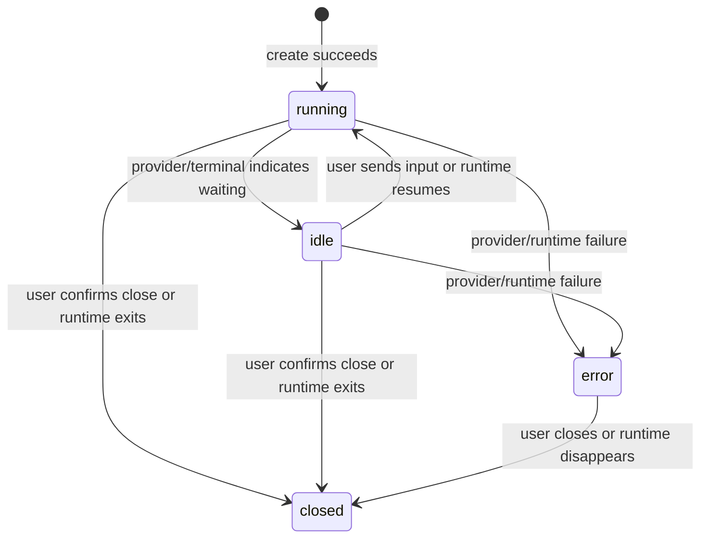
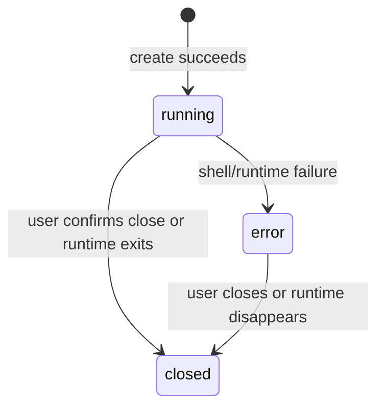
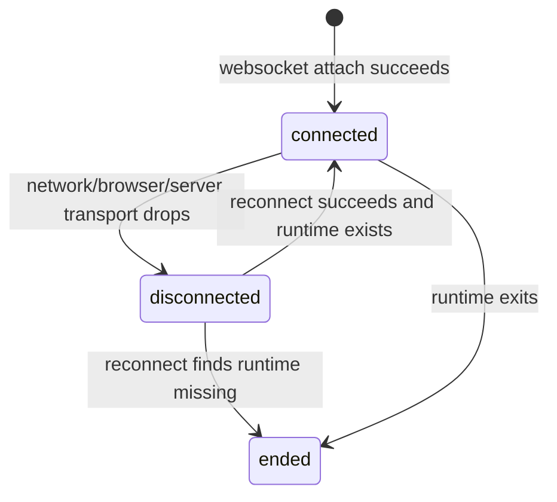

# Business Rules Design

## Change

- change-id：design-session-runtime-boundaries

## 业务概念

- **Agent Session**：Project 下的 Claude/Codex 交互式 Agent 会话，带 provider 语义，可表达等待用户输入等 Agent 特有状态。
- **Terminal Session**：Project 下的普通 shell 终端会话，不带 provider，不表示 Agent 历史。
- **Transport connection**：浏览器详情页与 runtime 的 WebSocket 连接，可断开和重连，不等同于 session 生命周期。
- **Runtime resource**：底层 tmux session/进程，是当前第一轮真实交互的执行资源。
- **Runtime metadata**：当前运行实例映射和状态，不是长期历史。

## 业务规则

### Rule: 创建 session 必须绑定 Project scope

- WHEN 用户创建 Agent Session 或 Terminal Session
- THEN 系统必须先解析并确认 Project 位于 `PROJECTS_ROOT` 下
- AND 底层 runtime cwd 必须是该 Project 安全解析后的目录
- OTHERWISE 拒绝创建，不启动 runtime

### Rule: Agent Session 必须有 provider

- WHEN 用户创建 Agent Session
- THEN provider 必须是当前支持的 `claude` 或 `codex`
- AND metadata 必须记录 provider
- OTHERWISE 创建失败

### Rule: Terminal Session 不得有 provider 语义

- WHEN 用户创建 Terminal Session
- THEN 系统创建普通 shell runtime
- AND metadata 不记录 Claude/Codex provider
- AND UI/API 不把它显示为 Agent 会话

### Rule: 关闭 session 表示终止 runtime

- WHEN 用户确认关闭 Agent Session 或 Terminal Session
- THEN 系统终止对应底层 tmux session/进程
- AND 从活跃列表移除该实例
- OTHERWISE 如果用户取消确认，则不改变 runtime 状态

### Rule: 底层 runtime 缺失时无需用户手动清理

- WHEN 列表或详情查询发现 metadata 对应的 tmux session 已不存在
- THEN 系统可以清理该 metadata 或返回 session ended 语义
- AND 列表随后不再展示该实例

### Rule: WebSocket 断开不关闭 session

- WHEN 浏览器 WebSocket 断开
- THEN 系统只更新 transport connection 状态
- AND 不终止底层 runtime
- AND 用户可在 runtime 仍存在时重新连接

## 状态流转

### Agent Session

- `idle` 是 Agent 专属可选状态，只在有可靠信号时使用。
- `closed` 可以是用户主动关闭，也可以是底层 runtime 结束后的结果。

### Terminal Session

### Transport connection

## 计算规则

- Project summary 中 session count 只统计当前 registry 中仍活跃或可判定的运行实例。
- session 展示名称可由 session 类型、provider、创建序号或短 id 自动生成；生成规则只影响展示，不影响 API 主键。
- tmux name 使用安全 project key、type、provider 和 short id 组合，长度和字符集以 tmux 可接受范围为准。

## 约束与例外

- Session id 必须唯一，且在当前 run dir 生命周期内稳定。
- Project 名称、display name 和 tmux name 是三个不同概念。
- Runtime metadata 丢失后不要求恢复列表；仍存在的孤儿 tmux session 可通过服务器侧诊断发现，但不作为第一轮产品承诺。
- Provider 未安装或未登录不是本系统自动修复的业务状态，应表现为创建/运行失败。

## 关键决策

- 将 session 生命周期和 transport 生命周期拆开，避免用户误以为网页断开会杀掉任务。
- 将 close 设计成确认后的终止动作，避免“关闭页面/隐藏列表”与“终止进程”混淆。
- 将 stale cleanup 作为系统自动行为，减少移动端用户维护运行态垃圾的负担。

## 风险与权衡

- 自动清理 stale metadata 可能让用户看不到刚异常退出的 session；详情页可以短暂展示 ended 作为补偿。
- `idle/waiting_input` 如果来源不可靠会误导用户；第一轮宁可少显示，不做猜测。
- 不做跨重启恢复会简化模型，但用户需要理解服务器重启后运行态列表为空是预期。

## 开放问题

- closed metadata 是否保留短时间用于展示“已结束”原因。
- 多客户端并发输入的冲突规则留到实现阶段或后续协作设计。

## 后续沉淀候选

- 生命周期和 transport/session 分离规则可沉淀到长期 session runtime design。
