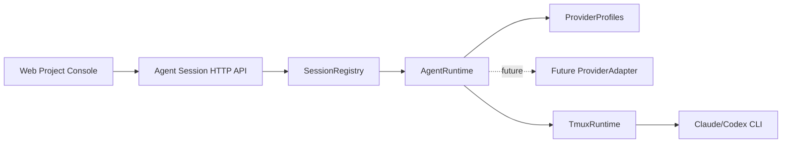

# Architecture Design

## Change

- change-id：implement-agent-provider-experience

## 架构上下文

- `design-session-runtime-boundaries` 已实现 Agent/Terminal Session 分离、Project-scoped HTTP/WS、SessionRegistry、runtime metadata 和 tmux runtime adapter。
- 当前 Agent Session create 已接受 provider 并可通过 tmux 启动 `claude` 或 `codex` CLI，但 provider 命令知识仍在 `TmuxRuntime` 内部。
- 长期架构要求 provider 差异由 Agent Runtime / Provider Adapter 吸收，控制面保持统一 Agent Session 语义。
- 历史会话读取/恢复已被确认为重要方向，但需要 provider-specific 证据和 PoC，不应在当前 change 中仓促实现。

## 系统边界

- `SessionRegistry`：继续负责 metadata、internal session id、Project/type/provider/displayName/status、create/list/detail/close；不理解 provider command 或 history schema。
- `AgentRuntime`：新增/收敛为 Agent Session runtime 入口，负责 provider profile lookup、启动当前 provider runtime、provider unavailable 错误映射和后续 adapter seam。
- `ProviderProfile`：实现层配置，描述 provider id、用户可见 label、默认 CLI command、默认 display name 前缀和后续 history capability 标记。
- `TmuxRuntime`：保留 tmux lifecycle/IO adapter，只接受已解析 command；不持有 Claude/Codex provider 选择逻辑。
- `ProviderAdapter`（后续）：读取 provider-native history/thread/transcript summary，执行 provider-native resume 或 attach，并输出 normalized Agent Runtime 事件。

## 模块关系

- API 仍调用 SessionRegistry createAgentSession。
- SessionRegistry 仍创建 metadata，并调用 runtime.startAgent(metadata)。
- AgentRuntime 根据 metadata.provider 解析 profile，再把 profile.command 交给 TmuxRuntime/terminal command runner。
- 后续 ProviderAdapter 可以替代或扩展 CLI passthrough，但不改变 Agent Session resource identity。

## 技术选型 / 方案取舍

- 选择进程内 `AgentRuntime` + provider profile，而不是新增 HTTP API 或数据库：当前只需要把 provider 差异从 tmux adapter 中抽出，避免浅层过度设计。
- 不新增 npm 依赖；provider profile 是少量 TypeScript 代码。
- 不实现 provider history storage：没有验证过 Claude/Codex 当前历史读取 API，提前建表或 UI 会制造假能力。
- 保留 CLI passthrough：第一轮真实可用链路需要保真 provider slash commands、skills、plugins 和交互提示。

## 演进策略

- 当前 change：抽出 AgentRuntime/provider profile，保证 Claude/Codex create/display/error 语义清晰且测试覆盖。
- 后续 provider experience：在 AgentRuntime 内新增 history discovery interface，例如 `listHistory(provider, project)` 输出 normalized summary。
- 后续 resume：用户选择 history summary 后，AgentRuntime 将 provider-native key 放入 internal metadata，并创建/连接一个当前运行 Agent Session。
- 后续 native UI：ProviderAdapter 输出 thread/turn/event/capability stream；Terminal/tmux passthrough 保留为 fallback 或 optional capability。

## 关键决策

- Agent provider profile 是内部实现 seam，不写入 shared，也不作为公开 API 资源。
- `TmuxRuntime` 不再依赖 `AgentProvider`；它只执行给定 command 和 tmux 操作。
- Agent displayName 仍由 SessionRegistry 根据 provider 生成；provider label 规则可以复用 provider profile，但 URL/API 主键仍是 internal session id。
- History capability 不进入 active Agent Session list；active list 只展示当前 runtime metadata。

## 风险与权衡

- 只抽出 provider profile看起来较小，但它修正了模块边界：tmux adapter 不再知道 Agent provider 业务概念。
- 不实现 history UI 可能让本 change 看起来偏轻；但 specs 已明确 history 是 staged capability，本轮的正确产出是稳定边界和非目标声明。
- Provider CLI command 名称仍是假设服务器已安装 `claude` / `codex`；provider unavailable error 和后续 probe/history adapter 可逐步增强。

## 开放问题

- Provider profile 是否需要从配置文件读取，留到用户需要自定义 CLI path/args 时再设计。
- History summary 是否归属于 AgentSession API 的子资源，还是单独 provider capability endpoint，需在后续 history/resume change 中设计。
- Claude Code remote-control 与 Claude API/Agent SDK 的 adapter 取舍仍需最新官方资料和实测。

## 后续沉淀候选

- `docs/architecture/agent-runtime.md`：AgentRuntime/provider profile、TmuxRuntime command boundary、history adapter seam。
- `docs/design/agent-provider-experience.md`：provider-visible Agent Session semantics 和 staged history capability。
