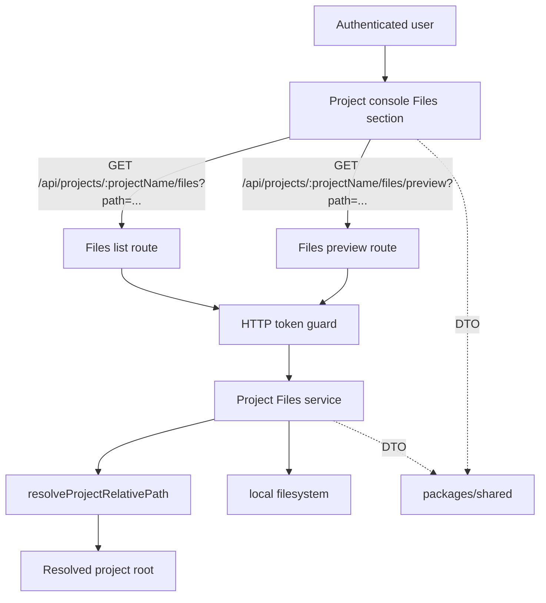

# Architecture Design

## Change

- change-id：implement-file-browser-preview

## 架构上下文

- Project 是 `PROJECTS_ROOT` 下一级真实目录，是 Console、Files、Git、Terminal Session 和 Agent Session 的统一作用域。
- 已验证的 Project safe path resolver 位于 `api` runtime 内，Files 必须复用它限制 project-relative path。
- `web` 只能通过同域 `/api` client 访问 Project-scoped 能力；不能直接依赖 `api` 内部模块或服务器真实路径。
- `packages/shared` 只承载跨 HTTP 边界的 DTO、preview union 和错误码。

## 系统边界

- 浏览器边界：只接收 DTO，不接收服务器绝对路径作为导航依据。
- API 边界：所有 project name 与 relative path 都在 `api` 内解析和验证。
- 文件系统边界：只允许读取当前 Project 内已存在目录或文件；不创建、不修改、不删除。

## 模块关系

- `api` Files route：负责鉴权、请求参数读取、调用 Files service、将 domain result 转为 HTTP response。
- `api` Files service：负责调用 safe path resolver、读取 `stat/readdir/readFile`、排序、preview type 判断和错误映射。
- `api/src/project-paths.ts`：继续作为 path trust boundary；Files 不重新实现 parent traversal 或 symlink escape 判断。
- `packages/shared`：新增 `ProjectFileEntry`、`ProjectFileListResponse`、`ProjectFilePreviewResponse`、preview type/error code 等类型。
- `web` Files section：负责 current path、selected file、列表/预览展示和用户恢复操作。

## 技术选型 / 方案取舍

- 沿用现有 Bun + Node fs API，不新增文件浏览依赖。
- 沿用现有 HTTP JSON API，不引入 WebSocket、streaming 或 range request。
- 图片预览使用 bounded JSON payload 中的 data URL，而不是新增下载接口；这样符合第一轮“不提供下载入口”的边界，但要求图片大小上限更严格。
- 文本类型识别使用扩展名 allowlist + UTF-8 fatal decode + 二进制控制字符检查；不引入 MIME sniffing 依赖。

## 演进策略

- 后续如需下载、上传、编辑或 rename，必须新建 change 并新增写操作规格，不复用 preview endpoint 作为隐式下载能力。
- 后续如需大文件文本分页、streaming 或 range preview，应扩展 API 契约，不改变当前 bounded preview union 的语义。
- 后续 Git diff 能力应复用同一 Project path boundary，但不应依赖 Files preview DTO。

## 关键决策

- Files service 是 `api` 内 Project-scoped 子能力，不进入 Project service 本体，避免 Project model 承担文件预览细节。
- 所有客户端 path 使用 project-relative string，空字符串代表 Project root。
- Directory listing 和 file preview 都只面向已存在 path；不存在 path 返回 file-specific not found error。
- 服务端负责稳定排序，避免多端排序差异。
- SVG 不 inline 到 DOM；前端只把 API 返回的 data URL 放进 ``，降低 XSS 风险。

## 风险与权衡

- Data URL 图片预览会增加 base64 体积；通过 5 MiB 图片上限控制内存和网络成本。
- 扩展名 allowlist 不能覆盖所有文本文件；第一轮优先避免二进制乱码和安全风险，宁可把未知格式展示为 unsupported。
- 目录列表第一轮不分页，极大目录可能一次返回较多 entries；本 change 仍不做分页，verify 应覆盖普通项目目录，后续如有性能问题再设计分页。

## 开放问题

- 无阻塞开放问题。

## 后续沉淀候选

- `docs/architecture/file-browser-preview.md`：Project-scoped Files 模块边界、DTO 和 safe path resolver 复用规则。
