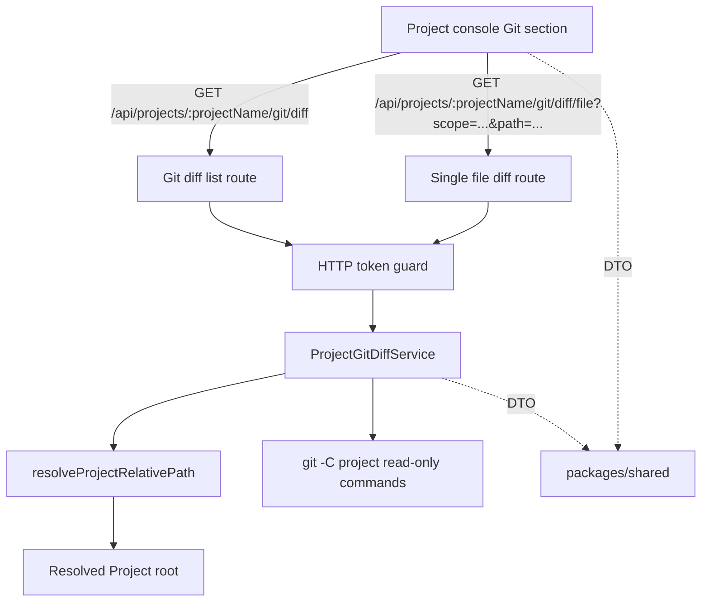

# Architecture Design

## Change

- change-id：implement-git-diff-viewer

## 架构上下文

- Project 是 `PROJECTS_ROOT` 下一级真实目录，是 Git/Files/Terminal/Agent 的统一作用域。
- Git diff viewer 必须复用 Project-safe path resolver 获得 Project root，不自行拼接用户路径。
- Files 已验证只读观察模式：shared DTO + `api` service/route + `/api` client + Project console section；Git 可复用模式但不复用 Files DTO。

## 系统边界

- 浏览器边界：只接收 DTO，不接收 Git 命令输出中的服务器绝对路径。
- API 边界：只在已认证请求中执行 Project-scoped 只读 Git 命令。
- Git 边界：不执行会改变 index、worktree、refs 或 remote state 的命令。

## 模块关系

- `api` Git route：负责鉴权、URL 参数解析、调用 Git diff service、返回 JSON DTO。
- `api` Git diff service：负责 Project path 解析、Git 仓库检测、变更列表解析、单文件 unified diff 获取和错误映射。
- `packages/shared`：新增 Git diff file summary、scope/status、list response、file diff response 和错误码。
- `web` Git section：负责加载变更文件列表、选择文件/scope、展示 unified diff 和非 Git/空状态。

## 技术选型 / 方案取舍

- 第一轮使用系统 `git` CLI，不新增 `isomorphic-git`、nodegit 或解析库。
- 使用 `git -C <projectPath>` 固定工作目录，避免通过 shell 拼接命令；执行时使用 argv 数组。
- 变更文件列表可基于 porcelain v1/v2 或 `git diff --name-status` + `git diff --cached --name-status` 解析，实施时选择更小且可测试的解析方式。
- 单文件 diff 使用 `git diff -- <path>` 或 `git diff --cached -- <path>`，返回 unified diff 文本。

## 演进策略

- 后续如需 stage/unstage/commit 等写操作，应新增 change 并重新设计权限、确认和回滚边界。
- 后续如需 PC 双栏 diff，可在不改变 API 只读语义的前提下新增前端渲染模式。
- 后续如需 rename/copy 更完整支持，可扩展 DTO，但保留当前 path/status/scope 基础字段。

## 关键决策

- Git diff viewer 是 `api` 内 Project-scoped 子能力，不进入 ProjectService 本体。
- 非 Git 仓库作为成功 response state 或明确 4xx 均可；推荐 list endpoint 返回 `repository: false` 状态，便于前端显示非异常提示。
- 文件列表服务端生成，前端不解析 raw Git 输出。
- 单文件 diff 请求 path 必须作为 query 参数传递，避免 encoded slash route 兼容问题。

## 风险与权衡

- 依赖系统 `git` CLI；如果部署环境缺少 git，应返回可理解错误而不是崩溃。
- Git output parsing 需要覆盖 rename/status 空格路径；实现应优先使用 NUL 分隔输出降低歧义。
- 大 diff 可能很长；第一轮不做分页，但可设置合理输出上限或在 verify 中记录后续风险。

## 开放问题

- 无阻塞开放问题。

## 后续沉淀候选

- `docs/architecture/git-diff-viewer.md`：Project-scoped Git diff service、Git CLI 只读命令和 DTO 边界。
