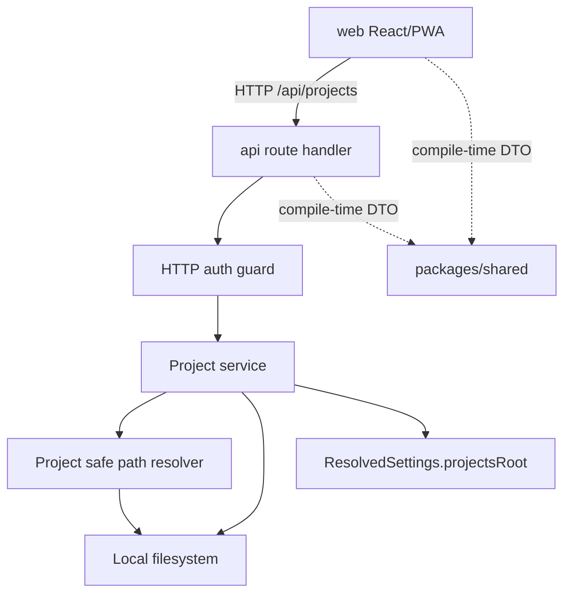

# Architecture Design

## Change

- change-id：implement-project-model-and-safe-paths

## 架构上下文

- 项目采用 `web/api/packages/shared` monorepo 边界：`web` 只通过 `/api` 调用后端，`api` 承接后端控制面能力，`packages/shared` 只保存跨边界类型和 DTO。
- `api/src/settings.ts` 已提供 `ResolvedSettings.projectsRoot`，并保证其来自配置文件或环境变量且为绝对路径。
- 现有 `/api` HTTP 路由在 `api/src/index.ts` 中集中分发，除公开 health/login 外，`/api/` 下请求会经过 HTTP token guard。
- `packages/shared/src/index.ts` 已定义 `Project` 类型，包含 `name`、`path`、session count 和可选 `gitBranch`。

## 系统边界

- `web` 边界：发起 Project 列表/创建/进入请求，处理 URL encode/decode，不直接拼接服务器文件路径。
- `api` route 边界：校验认证、解析 HTTP 请求、调用 Project service、转换响应/错误。
- Project service 边界：承接 Project 列表、创建/采用、详情解析和摘要构造。
- Safe path resolver 边界：承接 `PROJECTS_ROOT`、project 名称和 project-relative path 的统一安全解析。
- `packages/shared` 边界：只承诺 DTO/type，不包含文件系统、路径解析、配置读取或 runtime 控制逻辑。

## 模块关系

- `settings` 提供已验证的 `projectsRoot` 字符串；Project 模块把它作为 root 输入，不修改配置优先级。
- `project service` 依赖 `safe path resolver` 和文件系统操作，用于：
  - 枚举 `PROJECTS_ROOT` 一级目录。
  - 创建不存在的一级目录。
  - 采用已存在的一级目录。
  - 返回 `Project` DTO。
- `safe path resolver` 对外提供两个稳定语义：
  - 解析 project 名称为真实 project 根目录。
  - 解析 project 内相对路径为真实路径，并保证不越出 project 根。
- 后续 Files/Git/Terminal/Agent 模块只能依赖 safe path resolver 的语义，不应各自重新实现路径边界判断。

## 技术选型 / 方案取舍

- 不引入新第三方依赖；沿用 Bun/Node 文件系统与路径 API 即可满足目录枚举、创建和真实路径解析。
- 不引入数据库或 metadata 文件：目录本身是 Project 来源，避免注册表与磁盘状态分裂。
- 不把 path resolver 放进 `packages/shared`：虽然多个能力会复用它，但复用发生在 `api` runtime 内；放入 shared 会违反 shared 不依赖 runtime-only API 的长期边界。
- 不为 Git branch 引入同步强依赖：Project summary 可包含可选 `gitBranch`，但缺失不影响列表能力。

## 演进策略

- 本 change 先在 `api` 内形成 Project 模块与 safe path resolver，后续 Files/Git/Session changes 复用该模块语义。
- 如未来需要最近打开时间、收藏、排序或 project metadata，可在 Project service 后方增加持久化层；对外仍保持 project 名称是第一轮稳定身份。
- 如未来允许嵌套 project 或多 root，需要重新设计 Project identity；当前实现应避免把路径层级假设散落到调用方。
- 如未来存在多 server/hub，`PROJECTS_ROOT` 应成为单 server 内的 root boundary，而不是全局 project identity。

## 关键决策

- Project 模块属于 `api`，不是 shared 包，也不是 frontend 逻辑。
- `PROJECTS_ROOT` 的一级真实目录是 Project 的唯一来源。
- 安全路径解析是深模块：调用方提供 project 名称和相对路径，模块隐藏 root 规范化、真实路径和边界判断复杂度。
- 后续 project-scoped 能力必须依赖统一 resolver；这是安全边界，不是便利工具。

## 风险与权衡

- 目录即数据源让第一轮简单，但无法保存最近打开时间等衍生状态；这些延后到明确需要持久化时再设计。
- 一级目录限制牺牲嵌套 workspace 灵活性，但消除同名、多层 URL 和越界判断复杂度。
- 真实路径边界可以处理符号链接逃逸，但需要计划阶段明确测试覆盖；否则容易只测字符串前缀而留下安全缺口。
- Project `path` 暴露真实服务器路径有助于个人部署可见性，但 UI/API 错误不应在失败时泄露无关路径。

## 开放问题

- 无阻塞开放问题。
- 是否在列表中同步读取 Git branch 由计划阶段按实现成本决定；缺省返回不带 `gitBranch` 是已接受路径。

## 后续沉淀候选

- `docs/architecture/project-boundary.md`：Project service、safe path resolver 与下游 Files/Git/Session 的复用边界。
- `docs/architecture/monorepo-service-boundaries.md` 可追加 Project 模块属于 `api`、shared 只放 DTO 的规则实例。
