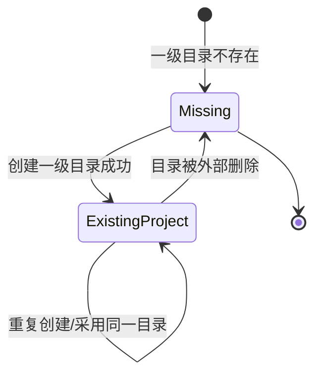

# Business Rules Design

## Change

- change-id：implement-project-model-and-safe-paths

## 业务概念

- **PROJECTS_ROOT**：个人部署配置中的绝对路径，是当前服务器上 Project 能力的根边界。它不是 Project 本身，也不是应用配置目录。
- **Project**：`PROJECTS_ROOT` 下的一级真实目录。Project 不需要数据库注册，不包含嵌套 project，不代表 Git 仓库必然存在。
- **Project 名称**：Project 一级目录名，是第一轮 URL/API 中的 project 标识。
- **Project 路径**：Project 一级目录的真实服务器路径，只能由 API 根据 `PROJECTS_ROOT` 和 Project 名称解析得到。
- **Project-relative path**：后续 Files/Git/Terminal/Agent 能力在某个 Project 内访问的相对路径，必须解析后仍留在该 Project 根目录内。

## 业务规则

### Rule: Project 来源

- WHEN `PROJECTS_ROOT` 下存在一级目录
- THEN 该目录是一个 Project
- OTHERWISE 非一级目录、普通文件或其他非目录条目都不是 Project

### Rule: Project 身份

- WHEN 系统需要在 URL/API 中标识 Project
- THEN 使用一级目录名作为 Project 名称
- AND 不允许用嵌套路径、绝对路径或显示名称替代 Project 名称

### Rule: Project 创建或采用

- WHEN 用户输入文件夹名称且 `PROJECTS_ROOT/<name>` 不存在
- THEN 系统创建该一级目录并返回 Project
- WHEN 用户输入文件夹名称且 `PROJECTS_ROOT/<name>` 已存在并且是目录
- THEN 系统采用该目录并返回 Project
- WHEN 用户输入绝对路径且该路径指向 `PROJECTS_ROOT` 的一级子目录
- THEN 系统创建或采用该一级子目录，并从最终文件夹名派生 Project 名称
- OTHERWISE 系统拒绝该请求

### Rule: 禁止的 Project 目标

- WHEN 目标路径越出 `PROJECTS_ROOT`
- THEN 拒绝创建或采用
- WHEN 目标路径是 `PROJECTS_ROOT` 本身
- THEN 拒绝创建或采用
- WHEN 目标路径是 `PROJECTS_ROOT/<project>/nested`
- THEN 拒绝创建或采用，因为第一轮不支持嵌套 Project
- WHEN 目标已存在但不是目录
- THEN 拒绝创建或采用，并且不得覆盖该文件

### Rule: Project 摘要

- WHEN Project 列表或详情返回 Project
- THEN 必须包含 `name`、`path`、`agentSessionCount`、`terminalSessionCount`
- AND 在 Session Runtime 未实现时，session count 返回 0
- AND `gitBranch` 缺失不得导致 Project 列表失败

### Rule: URL 编码

- WHEN Project 名称包含空格、中文或其他 URL-sensitive 字符
- THEN 前端负责 URL encode/decode 表达路径参数
- AND API 使用解码后的名称进行一级目录身份判断

## 状态流转

Project 本身没有独立数据库状态；其状态由文件系统目录存在性决定。

- 外部删除目录后，Project 从列表自然消失；本 change 不设计回收站或删除 API。
- 外部创建一级目录后，该目录自然成为 Project；本 change 不要求注册动作。

## 计算规则

- `name`：取 Project 一级目录最终文件夹名。
- `path`：取安全解析后的 Project 真实路径。
- `agentSessionCount`：第一轮返回 0，后续由 Agent Session Runtime 提供。
- `terminalSessionCount`：第一轮返回 0，后续由 Terminal Session Runtime 提供。
- `gitBranch`：可选；无法获得时省略。
- Project 列表排序：按 `name` 做稳定排序，避免 UI 因文件系统枚举顺序变化而抖动。

## 约束与例外

- `PROJECTS_ROOT` 必须已由配置能力校验为绝对路径；如果启动配置无效，Project API 不进入可用状态。
- 第一轮不允许两个不同路径拥有同一个 Project 名称，因为 Project 名称来自同一个 root 的一级目录。
- 第一轮不提供 Project 删除、重命名、移动或 clone。
- 第一轮不把 Git 仓库状态作为 Project 是否有效的条件。

## 关键决策

- 用目录存在性定义 Project，避免维护额外状态机。
- 用一级目录限制定义身份边界，降低 URL、权限和路径安全复杂度。
- 允许重复创建已存在目录返回成功，符合“采用目录”的用户意图。

## 风险与权衡

- 用户从磁盘外部改动目录会立即影响 Project 列表；这是目录即数据源的预期结果，不视为同步异常。
- 不持久化最近打开时间会限制列表排序/展示能力；该能力已明确延后。
- URL-sensitive 名称依赖前端正确 encode/decode；API 仍需拒绝解码后不合法的 project 标识。

## 开放问题

- 无阻塞开放问题。

## 后续沉淀候选

- `docs/specs/project-model/spec.md`：Project 术语、身份、创建/采用和摘要规则。
