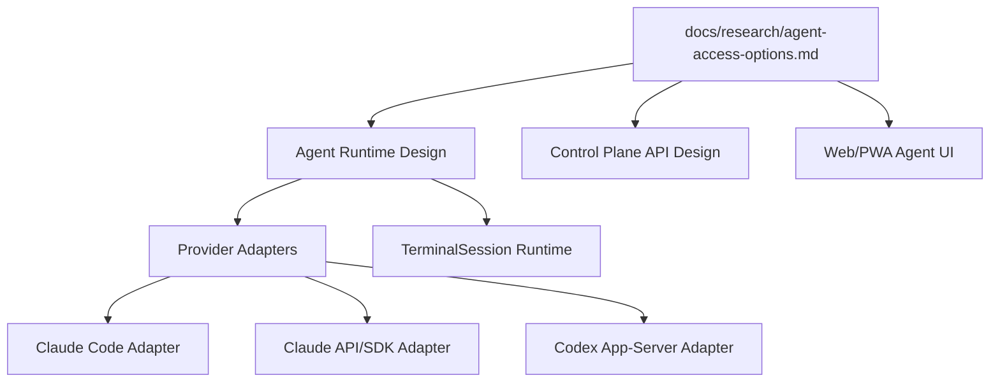
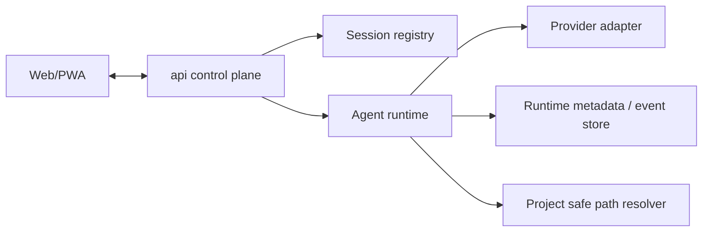

# Architecture Design

## Change

- change-id：research-agent-access-options

## 架构上下文

本项目目标是优化版 hapi：通过 Web/PWA 控制服务器上的 Claude/Codex Agent，同时保留后续接入其他 provider 的统一边界。当前 change 不实现 runtime，而是为后续 Agent Runtime/API 设计提供证据和约束。

已沉淀研究输入：`docs/research/agent-access-options.md`。

## 系统边界

本 change 产出的架构边界是研究结论的消费方式：

- `AgentSession` 是控制面的长期语义，不等同于 tmux session、Codex thread、Claude transcript 或 transport socket。
- `TerminalSession` 是普通 shell/PTY 语义，不应被混入 core Agent protocol。
- provider-native identifiers 只进入 metadata/adapters，不作为主 API URL 参数。
- `transportSession` 与 `conversationThread` 必须分离：前者服务连接/relay/reconnect，后者服务逻辑历史与恢复。

## 模块关系

后续 runtime 设计应至少保留以下边界：

- `api control plane` 只理解 provider-neutral DTO。
- `Session registry` 维护 internal session id、project、display name、provider、provider metadata、runtime state。
- `Agent runtime` 负责 lifecycle、event stream、resume/reconnect、capability negotiation。
- `Provider adapter` 吸收 Claude/Codex 差异。
- `Project safe path resolver` 是 files/git/terminal cwd 等 capability 的边界。

## 技术选型 / 方案取舍

本 change 不选择最终实现技术，但给出后续选择约束：

| 选项 | 当前判断 | 取舍 |
|---|---|---|
| CLI/tmux/xterm | 第一轮可用于真实交互和 TerminalSession | 快速可用，且最能保证 slash commands、skills、plugins、autocomplete 和交互提示不遗漏；但不能作为长期 Agent protocol |
| hapi pattern | 参考 dual-ID、sync engine、REST+SSE/message persistence | 不直接复制 provider metadata/fallback heuristics |
| remodex/Codex app-server | local-first Codex remote control 的强参考；Codex app-server 是 JSON-RPC-ish protocol over stdio/unix/ws transport | 协议演进和 security/auth/reconnect 需要 adapter 隔离 |
| Claude Code remote-control | Claude 官方 remote path 候选 | 当前不能假设可嵌入自有 Web UI |
| Claude API/Agent SDK | Claude-native runtime 长期候选 | 不等同于 Claude Code CLI session resume |
| 官方 Codex mobile app 互通 | 暂不作为目标 | 除非确认官方 app 支持 Git/files/project 或正式 extension mechanism，否则不能覆盖本项目控制台能力 |

## 演进策略

1. 第一轮用 stable internal ids 和 provider-neutral DTO 保护控制面。
2. TerminalSession 可先按 `tmux + xterm + WebSocket` 跑通，不反向污染 AgentSession；真实 CLI passthrough 是 V1 的保真策略。
3. AgentSession 初期可兼容 CLI/tmux，但 runtime 内部预留 `thread/turn/event/capability` 抽象。
4. Codex adapter 优先参考 remodex 的 `thread.*` / `turn.*` / seq-ack-replay / auth planes；同时准确区分 Codex app-server protocol 与其 stdio/unix/ws transport。
5. Claude adapter 分两条评估：Claude Code adapter 与 Claude API/SDK adapter。
6. 官方 app 互通只保留为开放问题，不阻塞自有 Web/PWA 控制面。
7. PoC/verify 后再决定哪些结论进入长期 architecture/ADR。

## 关键决策

- 使用 provider-neutral internal session id 做主键，provider-native id 只存 metadata。
- 将 `transportSession`、`conversationThread`、`turn/run` 分成不同概念。
- 将 `terminal.*`、`files.*`、`git.*` 等作为 capability extension，而不是 core AgentSession 必选字段。
- 社区反馈只能用于风险热点，架构决策以源码、官方资料和 PoC 结果为主。

## 风险与权衡

- 过早复制 Codex app-server schema 会被协议演进影响。
- 过早复制 Claude Code remote-control 假设可能遇到不可嵌入或非公开协议限制。
- 只用 terminal wrapping 虽然快，但会拖累后续 React 原生 Agent UI 化。
- 抽象过度也有风险；adapter seam 应围绕真实差异建立，而不是为假想 provider 泛化。

## 开放问题

- AgentSession 是否应暴露 thread/turn 词汇，还是只在 runtime 内部使用？
- 第一轮是否需要 event store 和 replay cursor，还是先仅维护 runtime metadata？
- Codex adapter 是否先做 PoC，再决定正式 API 形态？
- 官方 Codex mobile app 是否支持 Git/files/project 或正式 extension mechanism；在确认前不纳入目标。

## 后续沉淀候选

- `docs/architecture/agent-runtime.md`
- `docs/architecture/provider-adapters.md`
- `docs/architecture/adr/unified-agent-session-protocol.md`
