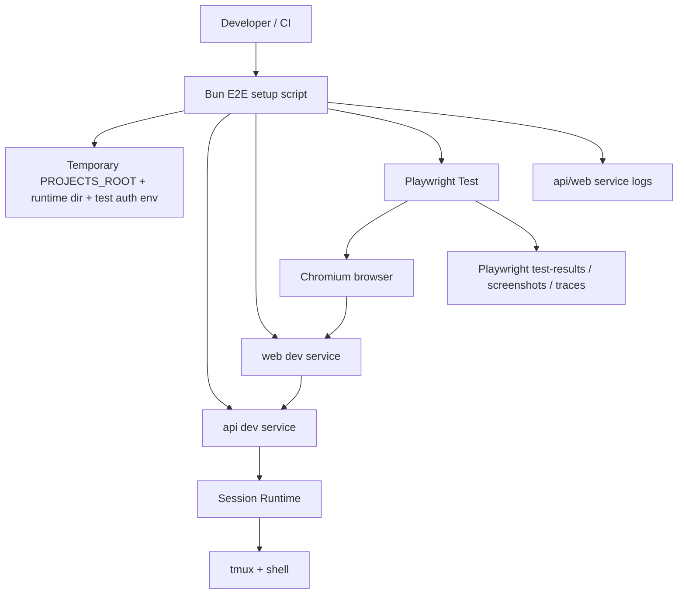

# Architecture Design

## Change

- change-id：setup-e2e-quality-baseline

## 架构上下文

- 项目是 Bun workspace，包含 `api`、`web`、`packages/shared`；现有质量入口为 format/lint/typecheck/unit/build。
- 用户要求 E2E 尽早覆盖多个子服务和真实 runtime，而不是只做静态页面或单模块测试。
- Session Runtime 已提供真实 Terminal Session HTTP API、WebSocket stream、tmux-backed shell runtime、reconnect/close 语义；移动端 Session Detail 已提供可交互输入/quick key 层。
- E2E baseline 需要成为项目内可重复运行的质量入口，后续 changes 可复用或扩展。

## 系统边界

- E2E harness 位于测试/工具边界，不改变生产 `api`、`web`、shared DTO 或 runtime API。
- 测试环境只使用临时 `PROJECTS_ROOT`、临时 runtime dir、测试密码和独立端口；不得写入用户真实 Project 或持久配置目录。
- Terminal Session E2E 必须使用真实 `tmux/shell` runtime；Agent Claude/Codex 真实 CLI 不属于第一轮通过条件。
- 浏览器操作通过 Playwright 执行，环境编排通过 Bun 脚本执行。

## 模块关系

- Bun setup script：创建临时目录、选择端口、启动 api/web、传入 env、收集服务日志、清理进程和 runtime。
- Playwright config/test：驱动浏览器、执行 web-first assertions、在 Terminal detail 中发送输入并等待输出。
- API/Web dev services：使用与本地开发相同入口，但由 E2E script 注入 isolated env。
- Artifacts：Playwright 自动 artifacts 与 api/web logs 共同构成失败 evidence。

## 技术选型 / 方案取舍

### 选定方案：Playwright Test + Bun orchestration

- Playwright Test 负责浏览器 E2E：官方资料确认支持 `webServer`、baseURL、screenshots on failure、trace/video/test-results 和浏览器项目配置。
- Bun 负责脚本执行和进程编排：官方资料确认可直接运行 TypeScript、使用 `Bun.spawn`/`Bun.spawnSync` 管理 subprocess，并具备 fetch/WebSocket runtime 能力。
- 项目使用 Bun/Vite/React，新增 Playwright 只进入 dev dependency 和 E2E 脚本，不进入生产 bundle 或 runtime。

### 不采用：Bun 原生脚本 + fetch/WebSocket 作为唯一 E2E

- 优点：几乎不新增依赖，适合 API/WebSocket protocol smoke。
- 不足：不能覆盖真实浏览器登录、路由、按钮交互、viewport、截图和用户路径 artifact。
- 结论：可作为 helper 或低层健康检查，但不能替代第一条 browser E2E baseline。

### 不采用：继续依赖 agent-browser / 手动 smoke

- 优点：已经用于阶段验证，适合探索性手动检查和截图。
- 不足：不是 repo 内测试入口；不适合作为 CI 可重复命令；报告、失败断言和 artifact 管理弱于 Playwright Test。
- 结论：保留为人工验证工具，不作为长期自动化基线。

### 依赖安全

- 候选 dev dependency：`@playwright/test`。
- 当前 npm metadata：`1.60.0` 发布于 2026-05-11；当前日期 2026-05-25，满足发布超过 7 天规则。
- `@playwright/test@1.58.2` 发布于 2026-02-06，也可作为 Context7 可查版本；除非安装时最新版本不满足 7 天规则，否则优先使用当前稳定版本。
- license：Apache-2.0；repository：Microsoft Playwright。
- 风险：Playwright 会带来浏览器下载/CI 系统依赖；通过只启用 Chromium smoke、记录安装步骤和不进入生产依赖降低风险。

## 演进策略

- 第一轮只新增一个 smoke spec：authenticated Project → Terminal Session → connected stream → deterministic command output。
- 先以本地可重复命令为目标；CI 只需要能调用同一命令，不在本 change 强行设计完整 pipeline。
- 后续可扩展：mobile viewport smoke、Agent fake provider smoke、close/reconnect regression、多浏览器矩阵、trace 上传、CI artifact retention。
- 如果 Playwright 在目标环境安装成本过高，可保留 Bun protocol smoke 作为 fallback，但不能把 fallback 写成通过 browser E2E 的替代结论。

## 关键决策

- E2E baseline 是 repo 内自动化质量入口，不再依赖一次性手动 smoke 作为主要证据。
- 测试隔离通过临时目录和独立 env 实现，不使用真实用户 Project 或生产 runtime dir。
- 浏览器断言必须验证行为结果，例如终端输出中出现确定性字符串，而不是只验证按钮存在。
- 失败 evidence 是 baseline 的一等产物：截图/trace/logs 必须能指出失败在登录、Project、Session 创建、WebSocket 还是 runtime IO。

## 风险与权衡

- 新增 Playwright 增加 dev dependency 和浏览器安装成本，但换来可持续 browser E2E、自动截图/trace 和 CI-ready 报告。
- 使用真实 tmux/shell 会让测试依赖运行环境；这是用户明确要求的真实依赖覆盖，应以清晰跳过/失败信息处理，而不是 mock 掉。
- E2E 过多会变慢且 flaky；第一轮只保留一条高价值 smoke，避免把所有细节路径都塞入 baseline。

## 开放问题

- CI 是否在本 version 内接入，还是只提交本地命令与 artifacts 规则。
- 是否需要在测试中直接断言 mobile Session Detail input panel，还是由后续 mobile E2E 扩展承接。
- 是否需要为 Agent fake provider 设计生产外的测试命令 seam。

## 后续沉淀候选

- `docs/architecture/e2e-quality-baseline.md`：E2E harness 架构、环境隔离和 artifact 规则。
- `docs/runbooks/e2e-quality-baseline.md`：本地运行 E2E、安装浏览器依赖、查看 failure evidence 的操作步骤。
