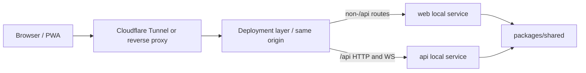
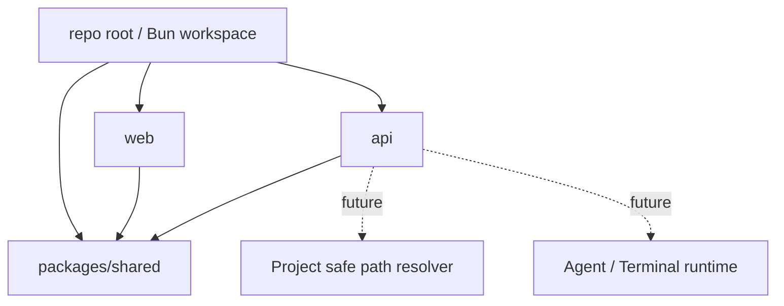

# Architecture Design

## Change

- change-id：setup-monorepo-service-boundaries

## 架构上下文

当前项目还没有实际 `web/api/packages/shared` 代码结构，本 change 是第一轮工程骨架设计。项目目标是通过 Web/PWA 控制服务器上的 Claude/Codex Agent，因此服务边界必须同时满足：

- 前端控制面可以独立演进。
- 后端控制 API 与 Agent/Terminal runtime 细节隔离。
- 后续 Project、Session Runtime、Files、Git、E2E changes 可以复用同一工程入口。
- 第一轮个人私有部署简单，不引入多 server/hub 管理。

## 系统边界

边界说明：

- `web` 是浏览器/PWA 控制面，不直接管理 provider runtime。
- `api` 是后端控制面服务，后续承载 auth、Project API、Session Runtime、WebSocket stream 等能力。
- `packages/shared` 是编译期共享类型边界，不是运行时业务模块。
- Deployment layer 是项目外部边界；应用只提供路径约定和示例，不创建或管理 Cloudflare Tunnel。

## 模块关系

依赖方向：

- `web` 和 `api` 可以依赖 `packages/shared`。
- `packages/shared` 不依赖 `web`、`api`、Node/Bun runtime-only APIs 或浏览器 APIs。
- `web` 不直接依赖 `api` 内部模块，只通过 HTTP/WebSocket API 交互。
- `api` 不托管 `web` 作为第一轮默认架构；两者由部署层统一入口。

## 技术选型 / 方案取舍

### 技术研究结论

- 使用基线：`.claude/skills/technology-research/references/default-web-stack.md`。
- 当前资料确认时间：2026-05-24。
- 已查资料：Bun 官方 docs、Vite 官方 docs、Tailwind CSS 官方 docs、TanStack Router docs、Jotai docs、npm package metadata。

| 技术 | 设计采用 | 当前资料确认 | 供应链判断 |
|---|---|---|---|
| Bun | workspace/package manager/script runner/api runtime/test baseline | Bun docs 确认 workspaces、`bun run --workspaces`、`bun test` 支持 | 使用已安装/稳定版本；实现阶段再锁具体版本 |
| React | `web` UI 框架 | npm 最新 19.2.6，发布时间早于 7 天 | 可采用 React 19 系列 |
| Vite | `web` dev/build tool + dev proxy | Vite docs 确认 `server.proxy` 支持 HTTP 与 WebSocket；npm 最新 8.0.14 发布不足 7 天 | 实现阶段应选择发布时间超过 7 天的 Vite 8.0.13 或更稳版本，除非用户确认使用最新 |
| Tailwind CSS | `web` 样式基础 | Tailwind docs 确认 v4 Vite plugin 路径；npm 最新 4.3.0 发布不足 7 天 | 实现阶段选择满足 7 天规则的稳定版本；如需 v4.3.0 需用户确认 |
| TanStack | 路由/服务端状态基础 | TanStack Router docs 确认 type-safe routing；Query 作为服务端状态候选 | 最新 Router/Query 发布频繁；实现阶段选满足 7 天规则的版本 |
| Jotai | 本地 UI 状态 | Jotai docs 确认 atom、Provider 可选、适合 scoped state | npm 2.20.0 发布时间早于 7 天，可采用 Jotai 2 系列 |
| Testing | 基础脚本入口 | Bun docs 确认 `bun test`；Vitest 最新 4.1.7 发布不足 7 天 | 当前 change 只预留入口，E2E 工具由后续 change 决定 |

### 方案取舍

- 不采用 Next.js：当前需求强调本机 `web/api` 服务拆分、PWA 控制台和同域代理，不需要 SSR/App Router 全栈框架复杂度。
- 不采用 `api` 托管 `web`：会削弱未来前端分离和 hub 化演进空间。
- 不采用多 package manager：Bun 已覆盖 workspace、scripts、runtime 和基础测试入口，混用会增加第一轮复杂度。
- 不把 Cloudflare 作为应用内部依赖：Cloudflare Tunnel 是部署层，不应进入 runtime 管理职责。

## 演进策略

1. 第一轮建立最小 workspace：根 package、`web`、`api`、`packages/shared`。
2. 所有用户可见路由从 `web` 进入；所有后端能力从 `/api` 前缀进入。
3. 开发环境用 Vite proxy 模拟生产同域路径，避免后续 API 调用散落成可配置跨域地址。
4. 后续 `configure-personal-app-settings` 承接端口和 web->api 地址配置。
5. 后续 `build-responsive-pwa-console-shell` 承接页面、PWA 和视觉实现。
6. 后续 `setup-e2e-quality-baseline` 承接真实依赖 E2E 工具与链路。

## 关键决策

- 根 workspace 是唯一包管理入口，所有 workspace scripts 应能从根目录发现或转发。
- `api` 命名是工程和用户概念边界，不能用 `agent` 替代。
- `packages/shared` 是类型包，不是业务逻辑共享层。
- `/api` 是同域后端能力的长期入口形态；WebSocket stream 不另开跨域默认地址。
- 技术栈版本不在 design 阶段追逐最新 patch；实现阶段遵守 npm 7 天规则。

## 风险与权衡

- Vite/Tailwind/TanStack 最新包发布频繁，直接锁 latest 可能违反供应链安全规则。
- Vite WebSocket proxy 配置如果误用 `rewriteWsOrigin` 可能引入 CSRF 风险。
- `packages/shared` 很容易被滥用为业务逻辑垃圾桶，需要在 plan/implementation 中明确边界。
- 只用 Bun test 可能不足以覆盖浏览器组件行为，但当前 change 只负责入口，E2E/组件策略后续细化。

## 开放问题

- 是否在第一轮实现时同时安装 `@tanstack/react-router` 与 `@tanstack/react-query`，还是只在用到具体能力时添加。
- 是否需要 shadcn/ui；当前 spec 未要求，不应在本 change 中主动引入。
- 是否需要 Oxc；当前 spec 未要求，不应为了默认基线而引入。

## 后续沉淀候选

- `docs/architecture/monorepo-service-boundaries.md`
- `docs/architecture/adr/first-round-web-api-split.md`
