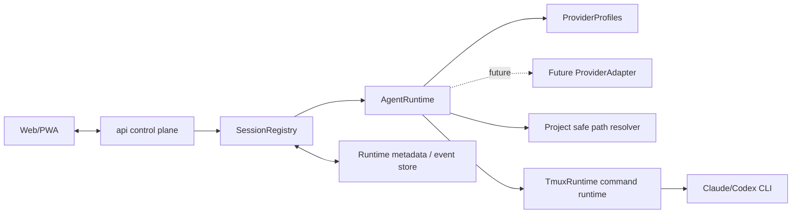

# Agent runtime architecture

本文件记录 Agent Runtime 与 Provider Adapter 的长期架构边界。它描述当前主线状态，不记录单次 change 过程。

## 背景

- 本项目需要通过 Web/PWA 控制服务器上的 Claude/Codex Agent，同时为后续接入其他 provider 保留统一边界。
- 第一轮真实可用链路需要尽快跑通真实 CLI 交互，但长期架构不能被 `tmux`、`xterm`、Codex app-server raw methods 或 Claude Code 内部会话细节绑定。
- 已验证的 Agent 接入路线研究表明，后续设计应采用 provider-neutral control plane、provider adapter seam 和 capability-based extension。
- 当前主线已经在 API 内建立薄 AgentRuntime/provider profile seam，用于吸收 Claude/Codex CLI command 差异，并保持 Agent Session HTTP contract 稳定。

## 当前结构

- Web/PWA 通过 `api control plane` 操作项目、会话和流式连接。
- 控制面长期语义以 `AgentSession` 为核心，而不是以 terminal session、provider thread、Claude transcript 或 transport socket 为核心。
- `SessionRegistry` 维护 internal session id、Project、type、provider、displayName、status、tmuxSessionName 和 runtime metadata；它不持有 provider CLI command。
- `AgentRuntime` 是当前 Agent Session runtime 入口，负责 provider profile lookup、provider CLI command 解析、provider unavailable 映射，并委托 command runtime 启动第一轮 CLI passthrough。
- `ProviderProfile` 是 API 内部实现 seam，当前包含 provider id、label、默认 command、display name prefix 和 staged capability 标记；它不是 shared DTO 或公开 API resource。
- `ProviderAdapter` 是后续扩展 seam，用于吸收 Claude/Codex history、resume、thread/turn/event/schema/auth/account state 和 compatibility 处理。
- `TerminalSession` 是普通 shell/PTY 语义，可服务第一轮真实 CLI passthrough，但不应反向污染 core Agent protocol。
- `TmuxRuntime` 当前负责 tmux lifecycle/IO 和 command execution；它只执行已解析 command，不决定 Claude/Codex provider 选择。

## 边界与职责

- `api control plane`：只理解 provider-neutral DTO 和本项目认证/路径安全边界。
- `SessionRegistry`：维护 internal session id、project、display name、provider、runtime metadata 和当前运行实例生命周期；不理解 provider command 或 history schema。
- `AgentRuntime`：负责 AgentSession lifecycle 入口、provider profile lookup、provider command delegation、provider unavailable mapping，并为后续 event stream、resume/reconnect、capability negotiation 和 provider adapter 调度保留边界。
- `ProviderProfile`：描述当前 provider 的内部 label、默认 CLI command、display name prefix 和 capability marker；不作为公开 API。
- `Provider adapter`：负责 Claude/Codex provider-specific launch、resume、thread/turn/event/schema/auth 适配。
- `TerminalSession runtime`：负责 PTY/terminal input、output、resize、buffer/reconnect 和 close semantics。
- `Project safe path resolver`：作为 files/git/terminal cwd 等 capability 的路径安全边界。

## 交互与依赖

- `AgentSession`、`TerminalSession`、`transportSession`、`conversationThread`、`turn/run` 是不同概念。
- `transportSession` 服务连接、relay、reconnect；`conversationThread` 服务逻辑历史和恢复。
- Provider-native id 只进入 metadata/adapters，不作为主 API URL 参数。
- `terminal.*`、`files.*`、`git.*`、`approvals.*`、`telemetry.*`、`artifacts.*` 是 gateway capability，不是 core AgentSession 必选字段。
- 当前 AgentRuntime 到 TmuxRuntime 的交互是 command-level：AgentRuntime 解析 provider profile command，TmuxRuntime 在 Project cwd 中执行该 command。

## 架构规则

- 第一轮真实可用链路（roadmap v0.1-v0.3）可以通过 `CLI/tmux/xterm/WebSocket` 保真真实 Claude/Codex CLI 能力。
- 第一轮 CLI passthrough 不得被当作长期 Agent protocol；tmux session name、xterm event name、CLI output parsing 都不得成为长期控制面 API。
- Provider command、display label、默认 display name prefix 和 staged capability 标记应集中在 AgentRuntime/provider profile seam，不应散落在 `TmuxRuntime`、web UI 或 session HTTP route 中。
- `TmuxRuntime` 不得导入 `AgentProvider` 或决定 provider command；它只负责 tmux lifecycle、terminal IO 和执行已解析 command。
- Provider unavailable、CLI missing、未登录或启动失败应被 AgentRuntime/adapter 映射到 provider/runtime error，并避免暴露 token、凭证、完整 shell command 或 provider-native metadata。
- Codex app-server 应被理解为 JSON-RPC-ish business protocol over `stdio://` / `unix://` / `ws://` transport；WebSocket 是 transport，不是协议本身。
- 不直接暴露或扩展 Codex app-server raw method set；本项目在 gateway/provider adapter 层做 capability extension。
- Claude Code remote-control 是 Claude Code adapter 候选，但在未验证前不能假设其提供稳定、可嵌入本项目 Web/PWA 的自托管协议。
- Claude API / Agent SDK 是 Claude-native runtime 长期候选，但不等同于恢复本机 Claude Code CLI 会话。
- 官方移动端 app 互通不是当前目标，除非未来确认官方 app 支持 Git/files/project 或正式 extension mechanism。
- 社区反馈只能作为风险热点和验证清单输入，架构决策应以源码、官方资料和 PoC/verify 结果为主。

## 风险与演进

- 过早复制 Codex app-server schema 会受到协议演进和 schema drift 影响。
- 过早复制 Claude Code remote-control 假设可能遇到不可嵌入或非公开协议限制。
- 只做 terminal wrapping 虽然能快速可用，但会限制后续 React 原生 Agent UI 化；因此必须保留 provider-native thread/turn/event/capability 演进空间。
- 抽象过度也有风险；adapter seam 应围绕真实 provider 差异建立，而不是为假想 provider 泛化。
- 当前 provider profile 的 history capability 只是 staged marker；实际 history discovery/resume 需要后续 provider-specific 证据、normalized summary 和公开 API 设计。
- 多客户端 attach/resume、event store/replay cursor、provider discovery API、官方 app 互通等问题仍需在后续 change 中验证。

## 来源

- change：research-agent-access-options
- verify 证据：`.workflow/changes/research-agent-access-options/verify.md`
- 研究材料：`docs/research/agent-access-options.md`
- change：implement-agent-provider-experience
- verify 证据：`.workflow/changes/implement-agent-provider-experience/verify.md`
- related spec：`docs/specs/agent-provider-experience/spec.md`
- related design：`docs/design/agent-provider-experience.md`
