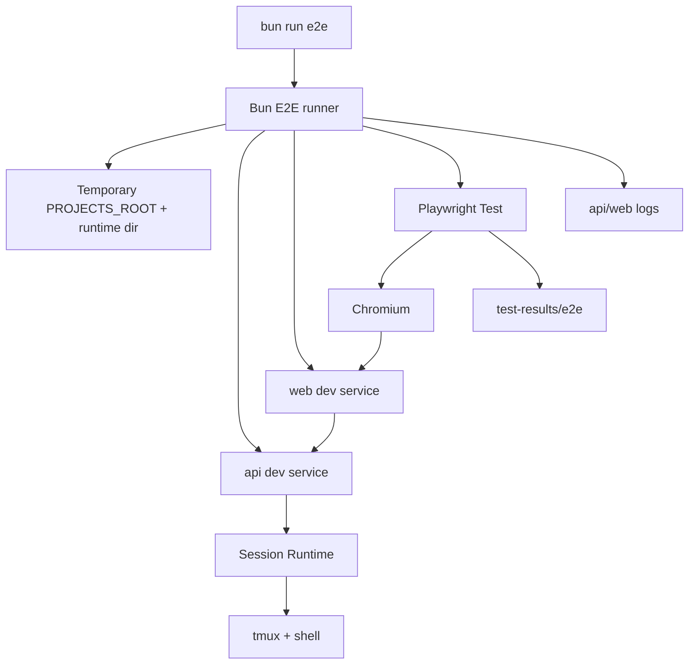

# E2E quality baseline architecture

本文件记录自动化 E2E 质量基线的长期架构。它描述当前主线状态，不记录单次 change 过程。

## 背景

- 项目包含 `web`、`api` 和真实 Session Runtime，关键风险来自跨服务、浏览器、WebSocket 和 tmux/shell runtime 的联通。
- 单元测试、typecheck、lint 和 build 不能证明用户从浏览器登录后能真实创建 Terminal Session 并发送输入。
- E2E baseline 的目标是用少量高价值 smoke 覆盖真实集成边界，同时保留失败 evidence。

## 当前结构

- `scripts/run-e2e.ts` 是 orchestration runner，负责环境准备、服务启动、ready 检查、Playwright 调用和清理。
- `playwright.config.ts` 是 browser E2E 配置，负责 testDir、Chromium 项目、baseURL、failure screenshot/trace/report 输出。
- `e2e/terminal-session.spec.ts` 是第一条 smoke：登录、Project、Terminal Session、Session detail、connected stream、确定性终端输出。
- `tsconfig.e2e.json` 让 E2E config/script/spec 进入 TypeScript 检查。

## 边界与职责

- E2E runner 属于开发/质量基础设施，不改变生产 HTTP API、WebSocket envelope、runtime metadata 或 UI 行为。
- 测试环境必须使用临时 `PROJECTS_ROOT` 和 runtime dir，不写入真实用户 Project 或持久配置目录。
- Terminal smoke 必须使用真实 `tmux/shell` 与 WebSocket stream；不能用 mock 替代后仍声称覆盖 runtime path。
- Claude/Codex 真实 Agent CLI 不属于第一条 baseline 的通过条件；Agent E2E 如需覆盖，应单独设计 fake provider 或测试命令 seam。
- `test-results/` 是 transient artifact 目录；长期 verify 证据保存在 `.workflow/changes/<change-id>/artifacts/` 或 verify 记录中。

## 交互与依赖

- `bun run e2e` 调用 Bun runner。
- Runner 创建临时目录和测试 Project，选择独立端口，设置测试密码和服务 env。
- Runner 启动 API/Web dev services，等待 API health 和 Web URL ready。
- Playwright 打开 Web 入口，完成登录，进入 Project console，创建 Terminal Session，打开 detail，等待 connected，发送确定性命令并断言输出。
- Runner 在 finally 中关闭子进程并删除临时目录。

## 架构规则

- 新增 E2E spec 应优先覆盖高价值跨服务路径，不要把低价值 UI 细节大量放进 E2E。
- E2E 断言必须验证行为结果；例如 Terminal smoke 要断言命令输出，而不是只断言按钮存在。
- E2E 文件必须进入 format、lint、typecheck，以避免质量入口自身腐化。
- 失败应保留可定位 evidence：Playwright screenshot/trace/report、api/web logs、当前 URL 或 session context。
- 缺少 Playwright browser、`tmux` 或 shell runtime 时不得静默通过；应明确失败或明确 skip 条件。

## 风险与演进

- Playwright 会带来浏览器安装和 CI 缓存成本；当前只启用 Chromium smoke，后续再评估多浏览器矩阵。
- 真实 tmux/WebSocket 可能有环境 flake；优先通过 isolated env、确定性命令、明确 timeout 和 logs 降低定位成本。
- 后续可扩展方向包括 mobile viewport smoke、Agent fake provider smoke、close/reconnect regression、CI artifact upload 和 browser cache。

## 来源

- change：setup-e2e-quality-baseline
- verify 证据：`.workflow/changes/setup-e2e-quality-baseline/verify.md`
