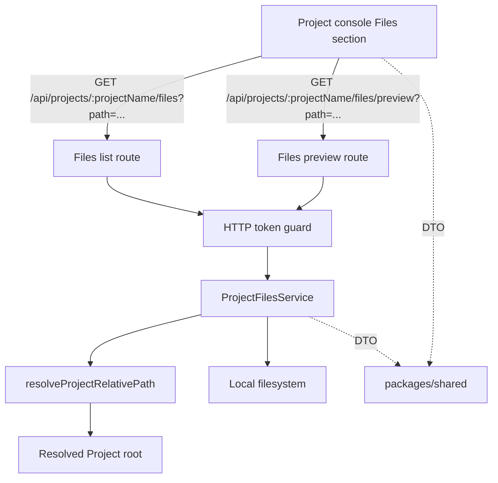

# File browser preview architecture

本文件记录 Project Files API、safe path 复用和 read-only preview 的长期架构边界。它描述当前主线状态，不记录单次 change 过程。

## 背景

- Project 是登录后 Console、Files、Git、Terminal Session 和 Agent Session 的统一作用域。
- `PROJECTS_ROOT` 是 project-scoped 数据访问根信任边界；下游 Files 能力必须复用 `api` 内已有安全路径解析。
- Files 第一轮是只读观察能力，不是文件管理器、下载服务或编辑器。

## 当前结构

- `packages/shared` 提供 Files DTO、preview union 和 error code。
- `api` 提供 Files service 与 Project-scoped HTTP routes。
- `web` 提供 Project console Files UI 和 `/api` client。

## 边界与职责

- `ProjectFilesService`：负责目录列表、文件预览、类型判断、大小限制、排序和文件系统错误映射。
- `resolveProjectRelativePath`：负责 Project name 和 project-relative path 的真实路径解析与越界拒绝。
- HTTP route：负责鉴权后解析 URL、调用 Files service、返回 JSON DTO 或标准 API error。
- `packages/shared`：只保存跨边界类型，不包含 filesystem、realpath、配置读取或 runtime 控制逻辑。
- `web`：只消费 DTO 并渲染列表/预览/错误状态，不做安全路径判断。

## 交互与依赖

- Files list route：`GET /api/projects/:projectName/files?path=<relative-path>`。
- Files preview route：`GET /api/projects/:projectName/files/preview?path=<relative-path>`。
- 空 path 表示 Project root；nested path 通过 query 参数传入，避免 encoded slash 路由兼容问题。
- API 在 read/readdir/readFile 前先解析 Project-safe path，并在读取完整文件前通过 `stat` 判断 preview size limit。
- 目录列表服务端排序：目录先于文件，同类型按名称升序；隐藏条目不被过滤。

## 架构规则

- Files API 只能提供只读 GET 能力；新增写操作必须通过单独 change 定义。
- Files 不重新实现 path traversal、absolute path 或 symlink escape 检查，必须复用 Project safe path resolver。
- Preview union 中 `unsupported` 与 `too_large` 是成功响应状态；path escape、missing、not file/not directory 和 filesystem error 才是 API error。
- 文本 preview 必须 bounded，并在安全解码失败或检测到二进制控制字符时返回 unsupported。
- 图片 preview 当前通过 bounded data URL 返回；SVG 只由前端作为 `` source 使用，不 inline。
- 错误响应不得泄露 Project 外部真实路径、堆栈或内部模块细节。

## 风险与演进

- Data URL 图片会产生 base64 体积膨胀；当前以 5 MiB 图片上限控制，未来如需大图可设计 range/streaming 或独立 content endpoint。
- 文本类型通过扩展名 allowlist 与 UTF-8/binary check 控制；未来如需更广泛类型支持，可引入明确 MIME/encoding 设计。
- 目录列表当前不分页；极大目录如成为真实问题，应新增 pagination/search/sort 契约。
- 当前 Files state 不进入 URL；如需要深链或刷新恢复，应在前端 route search params 中显式设计。

## 来源

- change：implement-file-browser-preview
- verify 证据：`.workflow/changes/implement-file-browser-preview/verify.md`
