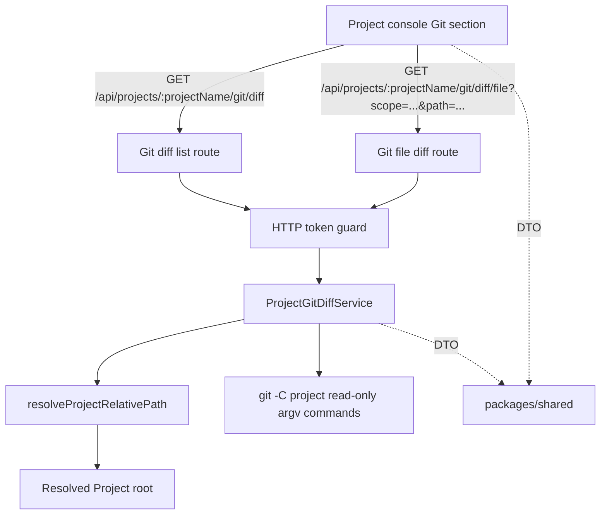

# Git diff viewer architecture

本文件记录 Project Git diff API、safe path 复用和 read-only Git CLI 边界的长期架构。它描述当前主线状态，不记录单次 change 过程。

## 背景

- Project 是登录后 Console、Files、Git、Terminal Session 和 Agent Session 的统一作用域。
- `PROJECTS_ROOT` 是 project-scoped 数据访问根信任边界；下游 Git 能力必须复用 `api` 内已有安全路径解析。
- Git diff viewer 第一轮是只读观察能力，不是 Git 写操作、代码审阅或远端同步系统。

## 当前结构

- `packages/shared` 提供 Git diff scope/status、file summary、list/file response 和 Git-specific error code。
- `api` 提供 `ProjectGitDiffService` 与 Project-scoped HTTP GET routes。
- `web` 提供 Project console Git UI 和 `/api` client。

## 边界与职责

- `ProjectGitDiffService`：负责 Project root 解析、Git 仓库检测、worktree/staged/untracked 变更列表解析、单文件 unified diff 获取和 Git 错误映射。
- `resolveProjectRelativePath`：负责 Project name 到 `PROJECTS_ROOT` 内真实目录的安全解析；Git service 不自行拼接 Project root。
- HTTP route：负责鉴权后解析 URL、调用 Git service、返回 JSON DTO 或标准 API error。
- `packages/shared`：只保存跨边界类型，不包含 Git CLI、filesystem、path resolver 或 runtime 控制逻辑。
- `web`：只消费 DTO 并渲染列表/diff/状态，不解析 raw Git status 输出，也不执行安全路径判断。

## 交互与依赖

- Git diff list route：`GET /api/projects/:projectName/git/diff`。
- Git file diff route：`GET /api/projects/:projectName/git/diff/file?scope=<worktree|staged>&path=<git-path>`。
- path 使用 query 参数传入，避免 encoded slash route wildcard 兼容问题。
- list route 在非 Git 仓库返回 `repository: false` 成功状态；无变更仓库返回 `repository: true` 且 `files: []`。
- file diff route 只接受 `worktree` 或 `staged` scope；path 必须是当前变更列表中的 path，不能是绝对路径或包含 `..`。
- Git 命令通过 Bun.spawn argv 数组执行，形如 `git -C <resolved-project-path> ...`；不通过 shell 拼接用户输入。

## 架构规则

- Git diff API 只能提供只读 GET 能力；新增写操作必须通过单独 change 定义。
- Git capability 不重新实现 Project name/path traversal 或 symlink escape 检查，必须复用 Project safe path resolver。
- 服务端负责解析 Git status/scope/status 映射，前端不解析 raw Git 输出。
- file diff 请求必须先校验 scope 和当前变更列表，再执行单文件 diff，避免任意 path 构造 Git 查询。
- Git command failure 不向前端泄露完整 argv、服务器绝对路径、stderr 原文或堆栈；使用结构化 API error。
- DTO 返回的 path 必须是 Git/project-relative path，不暴露服务器绝对路径。

## 风险与演进

- 当前依赖系统 `git` CLI；部署环境缺失 Git 时返回 `PROJECT_GIT_UNAVAILABLE`，不降级为 shell 命令输出。
- 单文件 diff 当前不分页；真实项目出现超大 diff 时，应新增 size limit、分页或 streaming 设计。
- 当前支持 basic status：modified、added、deleted、renamed；未来如需 copy、mode change、submodule 或 conflict 状态，应扩展 DTO 并补充 specs。
- 当前 Git UI 不提供 branch/remote/submodule 管理；这类能力应另行设计权限与错误恢复。

## 来源

- change：implement-git-diff-viewer
- verify 证据：`.workflow/changes/implement-git-diff-viewer/verify.md`
