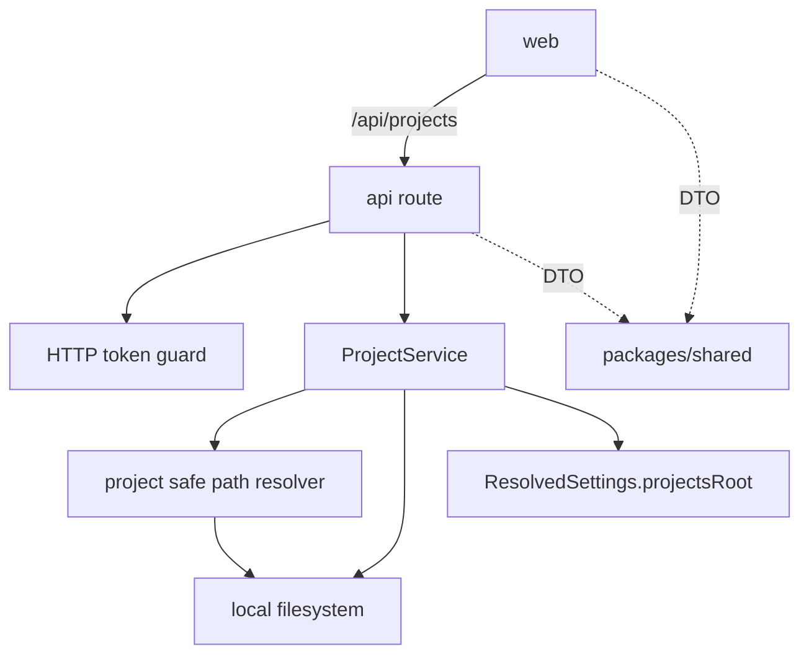

# Project boundary architecture

本文件记录 Project 模块、安全路径解析和下游 project-scoped 能力的长期架构边界。它描述当前主线状态，不记录单次 change 过程。

## 背景

- Project 是登录后控制台、Files、Git、Terminal Session 和 Agent Session 的统一作用域。
- `PROJECTS_ROOT` 是个人部署中 project-scoped 数据访问的根信任边界，已由配置能力保证为绝对路径。
- 路径安全必须集中在 `api` runtime 内实现，避免每个 project-scoped 模块各自拼接路径和判断越界。

## 当前结构

- `packages/shared` 提供 Project DTO、Project API request/response type 和跨边界 error code。
- `api` 提供 Project service、Project HTTP routes 和安全路径解析。
- `web` 只通过同域 `/api/projects` 调用 Project API，不直接拼接服务器路径。

## 边界与职责

- `PROJECTS_ROOT`：当前服务器内 Project 能力的根边界，不是 Project 本身，也不是应用配置目录。
- Project：`PROJECTS_ROOT` 下的一级真实目录；不需要数据库注册，不要求是 Git 仓库。
- Project 名称：一级目录名，是第一轮 URL/API 中的 project 标识。
- Project service：负责列出一级目录、创建或采用一级目录、返回 Project summary。
- Safe path resolver：负责把 project 名称和 project-relative path 解析到真实路径，并保证结果不越出允许边界。
- 下游 Files/Git/Terminal/Agent 模块：必须复用 safe path resolver 语义获得工作目录或访问路径，不应自行实现路径边界判断。

## 交互与依赖

- `api` 启动时从 settings 读取 `projectsRoot`，并用它初始化 Project service。
- Project HTTP API 位于 `/api/projects`，沿用现有 HTTP token guard。
- Project 列表与详情通过 Project service 返回 summary：`name`、真实 `path`、`agentSessionCount`、`terminalSessionCount`，`gitBranch` 可选。
- `POST /api/projects` 接收用户输入的文件夹名称或绝对路径；只有 `PROJECTS_ROOT` 的一级子目录可被创建或采用。
- Project-relative path 解析以已解析的 project 根目录为边界，拒绝 parent traversal、symlink escape 和真实路径越界。

## 架构规则

- Project 模块属于 `api`，不是 `packages/shared`，也不是 frontend 逻辑。
- `packages/shared` 只保存 Project DTO、request/response type 和 error code；不得加入文件系统、realpath、配置读取或 runtime 控制逻辑。
- Project identity 在第一轮只能是 `PROJECTS_ROOT` 下一级目录名；不支持嵌套 project、多 root 或跨路径同名 project。
- 成功响应可以向已认证用户返回 Project 真实路径；失败响应不应泄露无关外部路径、堆栈或内部模块细节。
- 认证通过不替代路径安全；所有 project-scoped 操作仍必须经过 `PROJECTS_ROOT` 安全解析。

## 风险与演进

- 目录即数据源让第一轮模型简单，但无法表达最近打开时间、收藏、排序偏好等衍生状态；需要时可在 Project service 后方新增持久化层。
- 当前 Project-relative path 解析面向已存在目标；后续 Files/Git 如需处理尚不存在路径，应在对应 change 中扩展 resolver 语义并补充测试。
- 如果未来支持嵌套 project、多 `PROJECTS_ROOT` 或多 server/hub，需要重新设计 Project identity，不能把当前一级目录假设散落到调用方。
- `PROJECTS_ROOT` 是单 server 内边界；未来 hub 化时不应把一级目录名误当作全局唯一 project identity。

## 来源

- change：implement-project-model-and-safe-paths
- verify 证据：`.workflow/changes/implement-project-model-and-safe-paths/verify.md`
