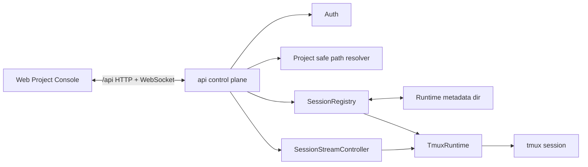

# Session runtime architecture

本文件记录 Agent/Terminal Session runtime 的系统级长期 HOW，包括 registry、runtime metadata、tmux adapter、HTTP/WS 入口和 stream transport 边界。它描述当前主线状态，不记录单次 change 过程。

## 背景

- Project console 需要创建、连接、重连和关闭服务器上的 Agent/Terminal 运行实例。
- 当前主线采用 Bun `api` 作为控制面，`web` 通过同域 `/api` HTTP/WebSocket 访问 runtime 能力。
- 第一轮 runtime metadata 只需要描述当前运行实例，不承诺跨服务器重启恢复。

## 当前结构

- `packages/shared` 定义跨边界 DTO、状态枚举、stream envelope 和 session error code。
- `api` 内部持有 SessionRegistry、session HTTP routes、session stream controller 和 tmux runtime adapter。
- SessionRegistry 将 internal session id 映射到 Project、session type、provider、displayName、status、runtimeKey 和 timestamps。
- Runtime metadata 存放在 `AGENTS_REMOTE_RUN_DIR` 或默认 `/run/agents-remote` 下的运行态目录中，不写入 Project 目录或 `~/.agents-remote` 配置目录。
- TmuxRuntime 负责普通 shell / provider CLI 的 `tmux new-session`、`send-keys`、`resize-window`、`capture-pane` 和 `kill-session`。
- WebSocket stream attach 到具体 Agent/Terminal Session 资源，发送 connected/snapshot/output/status/ended/error envelope，接收 input/resize/ping。

## 边界与职责

- `web`：只调用 `/api` HTTP/WS，展示 Project-scoped Agent/Terminal lists、detail stream、input/reconnect/close controls；不直接知道 runtime dir 或 tmux resource naming。
- `packages/shared`：只承载跨服务 contract，不放 Project path resolver、registry、tmux、provider adapter 或文件系统逻辑。
- `api control plane`：统一处理 auth、Project safe path resolver、session HTTP routes、WebSocket upgrade 和错误映射。
- `SessionRegistry`：是当前运行实例 metadata 的权威索引，负责 create/list/detail/close、stale cleanup、session counts 和 control-plane identity 到 runtime resource 的映射。
- `TmuxRuntime`：是当前 runtime adapter，负责实际 tmux session lifecycle 和 terminal IO。
- `Agent provider seam`：当前用 provider command 启动 Claude/Codex CLI；provider-native thread/turn/event adapter 后续在 Agent Runtime 内扩展，不改变 Terminal Session 语义。

## 交互与依赖

- HTTP list/detail/count operations read metadata through SessionRegistry and can clean stale entries when tmux no longer exists.
- HTTP create resolves Project path first, creates metadata, starts runtime, and removes metadata if runtime startup fails.
- HTTP close finds metadata by Project + type + session id, kills runtime if it exists, then removes metadata.
- WebSocket upgrade resolves Project + session id, attaches tmux resource name to socket data, sends snapshot, then polls for output changes.
- WebSocket close only clears transport timers; it does not close the Agent/Terminal Session runtime.

## 架构规则

- All public session runtime endpoints live under `/api/projects/:projectName/{agent-sessions|terminal-sessions}`.
- Agent and Terminal use parallel resource paths rather than a generic `/sessions?type=...` path to preserve product semantics.
- `sessionId` is opaque to callers; callers must not parse prefixes, short ids, provider, tmux names or timestamps from it.
- `runtimeKey` is internal-only and must be generated from safe project key + type + optional provider + short id.
- Runtime metadata belongs to runtime dir; long-term config belongs to `~/.agents-remote`, and Project data belongs under `PROJECTS_ROOT`.
- A WebSocket stream is transport state, not a session lifecycle authority; session close must go through explicit close action.
- Provider CLI unavailable errors should be mapped to provider/runtime errors and must not expose credentials, tokens or full command internals to clients.

## 风险与演进

- Current stream output is snapshot/poll based; future terminal UX may need xterm-compatible diffing, scrollback limits, backpressure and binary handling.
- Multi-client attach currently has no writer/observer policy; future collaborative or mobile usage should define input ownership and resize semantics.
- Run-dir-only metadata means server restart loses registry state; that is acceptable for current scope but future recovery would need a separate design.
- Agent provider-native thread/turn/event support can evolve inside Agent Runtime / Provider Adapter while preserving current AgentSession identity and TerminalSession runtime boundaries.

## 来源

- change：design-session-runtime-boundaries
- verify 证据：`.workflow/changes/design-session-runtime-boundaries/verify.md`
- related design：`docs/design/session-runtime-boundaries.md`
- related spec：`docs/specs/session-runtime/spec.md`
